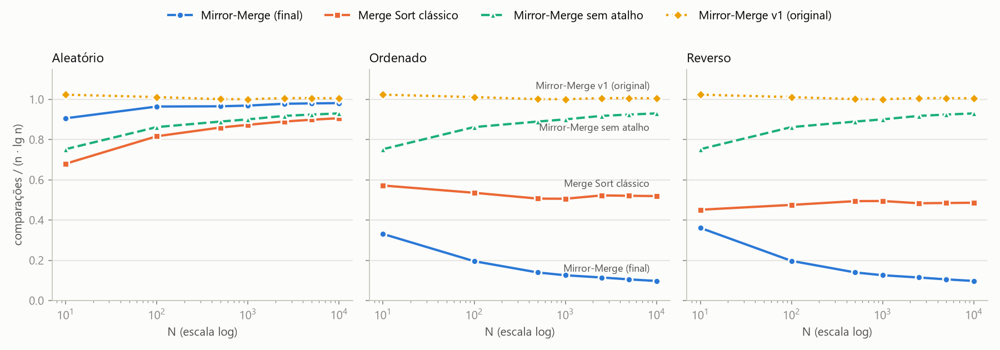
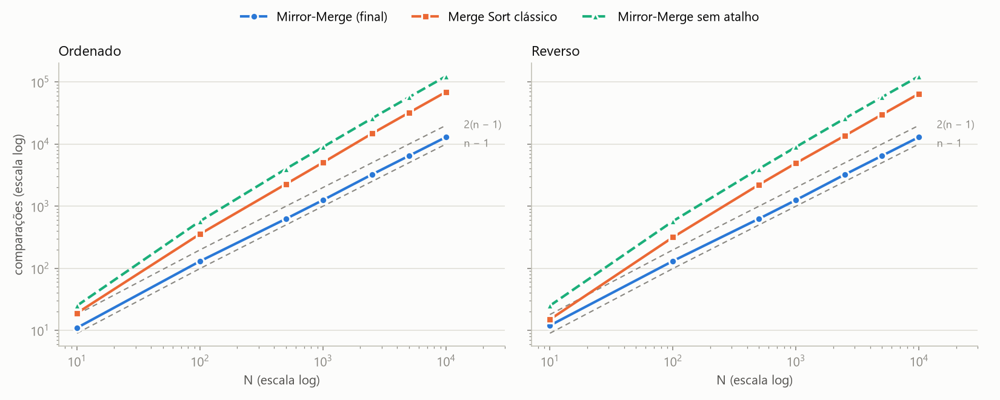
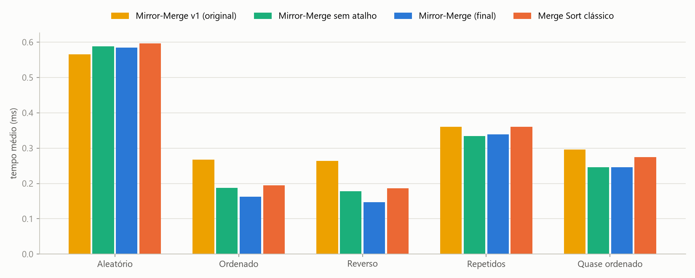
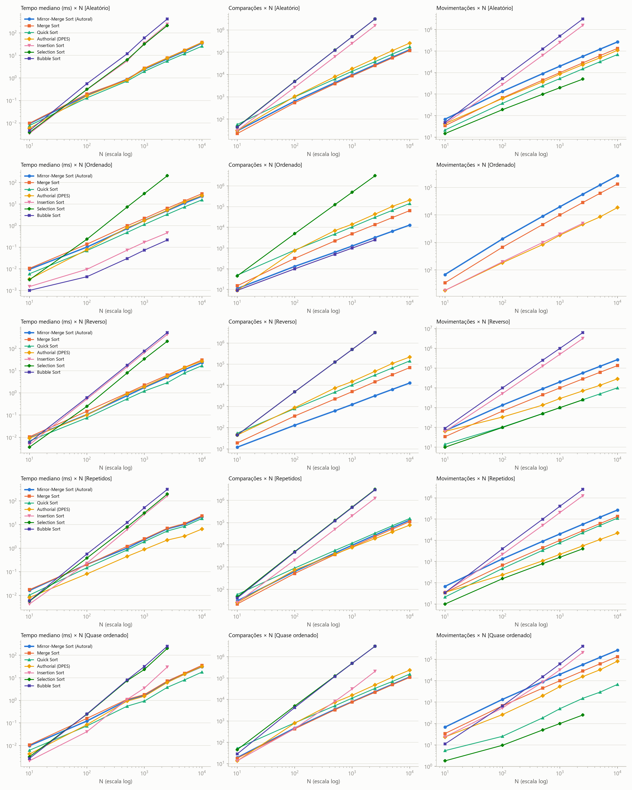

# Relatório Técnico: Mirror-Merge Sort (Ordenação por Fusão Espelhada)

**Trabalho Prático 1 (TP1) de Análise e Projetos de Algoritmos (APA)**

**Autora:** Rafaela Pacheco

**Repositório (código-fonte, testes e benchmarks):** [https://github.com/rafaelapnunes/metodos-ordenacao-apa](https://github.com/rafaelapnunes/metodos-ordenacao-apa)

> **Natureza do método (declaração de originalidade).** O Mirror-Merge Sort **não é um algoritmo inédito**: é uma **adaptação declarada** que combina três técnicas publicadas: (i) a fusão bitônica pelas extremidades, descrita por Sedgewick; (ii) a alternância de direção entre subproblemas, do Bitonic Sort de Batcher; e (iii) o teste que pula a fusão quando as metades já estão em ordem, também de Sedgewick. A Seção 1.3 identifica as fontes, a Seção 1.4 descreve os refinamentos e a Seção 4.2 compara diretamente com cada técnica.

---

## 1. Concepção e Raciocínio Projetual

### 1.1 O problema do Merge Sort clássico

No Merge Sort tradicional, cada iteração da fusão verifica **duas** condições de fronteira (`i <= mid` **e** `j <= high`), porque qualquer uma das metades pode acabar primeiro. Quando uma delas acaba, são necessários laços adicionais (dois `while` extras) só para esgotar os elementos restantes da outra metade.

### 1.2 A ideia: geometria bitônica

O Mirror-Merge elimina essas verificações mudando a **forma** dos dados antes da fusão. Em vez de ordenar as duas metades no mesmo sentido, ordena a metade esquerda de forma **crescente** e a metade direita de forma **decrescente** (espelhada). O segmento `A[low..high]` passa a ter a forma de uma montanha (uma sequência **bitônica**): sobe até o meio e desce até o fim.

*Metáfora:* numa cordilheira com um único pico, o ponto mais baixo está sempre numa das duas pontas. Se colocarmos um ponteiro em cada extremidade (`i = low`, `j = high`) e sempre retirarmos o menor dos dois, os ponteiros caminham um em direção ao outro. O que resta entre eles continua sendo uma "montanha", mesmo quando um ponteiro atravessa o pico e entra na outra metade. A única condição de parada é `i < j`: não há teste de fronteira por metade nem laço de esgotamento.

Para que a metade direita já saia **decrescente** da recursão, sem precisar invertê-la depois, cada chamada recebe um parâmetro de direção. Um nó crescente pede ao filho esquerdo uma ordem crescente e ao direito uma decrescente. Um nó decrescente faz o espelho: esquerda decrescente e direita crescente, formando um "vale" cujo **máximo** está sempre numa das pontas.

### 1.3 Origem na literatura (técnicas de base)

| Técnica de origem | Referência | O que foi aproveitado |
| :--- | :--- | :--- |
| Fusão sem sentinelas copiando a 2ª metade **em ordem reversa** (sequência bitônica) e intercalando pelas duas extremidades | R. Sedgewick, *Algorithms in C++, Parts 1–4*, 3ª ed., 1998, Cap. 8 (merge abstrato, Programa 8.2); R. Sedgewick & K. Wayne, *Algorithms*, 4ª ed., 2011, Exercício 2.2.10 ("Faster merge") | O laço de fusão com dois ponteiros vindos das pontas e uma única condição de parada |
| Ordenar as duas metades em **sentidos opostos** para formar uma sequência bitônica | K. E. Batcher, "Sorting networks and their applications", *AFIPS Spring Joint Computer Conference*, 1968 (Bitonic Sort) | A recursão com parâmetro de direção que alterna entre os filhos |
| Pular a fusão quando `a[mid] <= a[mid+1]` (as metades já estão em ordem) | R. Sedgewick & K. Wayne, *Algorithms*, 4ª ed., 2011, Exercício 2.2.8 e melhorias da Seção 2.2 | A ideia de testar os extremos das metades antes de fundir (Seção 1.4, refinamento 3) |

### 1.4 Refinamentos do projeto

A primeira versão do método (v1) seguia exatamente a ideia da Seção 1.2. A análise dessa versão (Seção 6 da versão anterior deste relatório) mostrou três fraquezas, cada uma corrigida por um refinamento:

1. **O sentido era testado dentro do laço.** A v1 avaliava `se crescente` a cada iteração da fusão, embora o valor nunca mude durante uma fusão. Isso contradizia a própria motivação de "um único teste por iteração". *Refinamento:* o sentido é testado **uma vez**, antes da fusão, e há dois laços (um para a montanha, outro para o vale), cada um testando só `i < j`.
2. **O último elemento era comparado consigo mesmo.** Com a condição `i <= j`, a última iteração de cada fusão (quando `i = j`) comparava `A[i]` com ele próprio, desperdiçando uma comparação por fusão (n − 1 no total). *Refinamento:* o laço para em `i < j` e o elemento que sobra é copiado sem comparar. Ele é necessariamente o maior (montanha) ou o menor (vale) do segmento. Com isso, o número de comparações passa a ser **exatamente igual ao pior caso do Merge Sort clássico** (Seção 3.1).
3. **O método não aproveitava ordem pré-existente.** A v1 fazia sempre as mesmas comparações, mesmo em vetores já ordenados ou reversos. *Refinamento (atalho adaptativo):* antes de fundir um segmento com 3 ou mais elementos, o método testa se as metades já estão **separadas**, isto é, se todos os elementos de uma metade não passam dos da outra. A estrutura bitônica coloca os quatro extremos relevantes em posições conhecidas:
   - na montanha, `A[mid]` é o máximo da esquerda, `A[high]` é o mínimo da direita, `A[low]` é o mínimo da esquerda e `A[mid+1]` é o máximo da direita;
   - se `A[mid] <= A[high]`, a esquerda inteira vem antes: a saída é a esquerda seguida da direita **invertida** (1 comparação);
   - se `A[low] > A[mid+1]`, a direita inteira vem antes: a saída é a direita invertida seguida da esquerda (2 comparações);
   - no vale, os testes são os simétricos (`>=` e `<`).

   O segundo teste é **estrito** para que, em caso de empate, a esquerda continue vindo primeiro e iguais não sejam invertidos sem necessidade. O atalho não é aplicado a segmentos de 2 elementos, porque neles a fusão já resolve com 1 comparação.

O efeito de cada refinamento é medido separadamente na Seção 5, comparando a v1, a versão sem atalho (refinamentos 1 e 2) e a versão final (1, 2 e 3). A implementação mantém as duas últimas acessíveis pelo parâmetro `adaptive` de `my_authorial_sort`.

---

## 2. Especificação Formal

### 2.1 Pseudocódigo

```text
função MirrorMergeSort(A, low, high, crescente):
    se low >= high:
        retornar

    mid = low + (high - low) / 2          // divisão inteira: |esq| = ⌈m/2⌉, |dir| = ⌊m/2⌋

    // Chamadas espelhadas
    MirrorMergeSort(A, low, mid, crescente)
    MirrorMergeSort(A, mid + 1, high, não crescente)

    // Atalho adaptativo (só para segmentos com 3 ou mais elementos)
    se high - low >= 2:
        se (crescente e A[mid] <= A[high]) ou (não crescente e A[mid] >= A[high]):
            Temp[low..high] = A[low..mid] seguido de A[high], A[high-1], ..., A[mid+1]
            copiar Temp[low..high] para A[low..high]
            retornar
        se (crescente e A[low] > A[mid+1]) ou (não crescente e A[low] < A[mid+1]):
            Temp[low..high] = A[high], A[high-1], ..., A[mid+1] seguido de A[low..mid]
            copiar Temp[low..high] para A[low..high]
            retornar

    // Fusão bitônica: o sentido é decidido uma vez, fora do laço
    i = low
    j = high
    k = low
    se crescente:
        enquanto i < j faça:              // montanha: retira o menor das pontas
            se A[i] <= A[j]:
                Temp[k] = A[i];  i = i + 1
            senão:
                Temp[k] = A[j];  j = j - 1
            k = k + 1
    senão:
        enquanto i < j faça:              // vale: retira o maior das pontas
            se A[i] >= A[j]:
                Temp[k] = A[i];  i = i + 1
            senão:
                Temp[k] = A[j];  j = j - 1
            k = k + 1
    Temp[k] = A[i]                        // i = j: o último elemento, sem comparação

    copiar Temp[low..high] para A[low..high]
```

Chamada inicial: `MirrorMergeSort(A, 0, n-1, verdadeiro)`, com `Temp` alocado uma única vez com tamanho `n`.

### 2.2 Exemplo 1: o atalho falha e a fusão é usada

Vetor inicial: `[8, 3, 5, 2]` (crescente)

1. **Divisão e chamada recursiva:** esquerda `[8, 3]` → ordena crescente; direita `[5, 2]` → ordena decrescente.
2. **Esquerda `[8, 3]` (crescente, 2 elementos, sem atalho):** `i=0` (8), `j=1` (3). `8 <= 3`? Falso. Pega o 3, `j--`. Agora `i = j = 0`: copia o 8 sem comparar. Resultado: `[3, 8]` (1 comparação).
3. **Direita `[5, 2]` (decrescente, 2 elementos):** `5 >= 2`? Verdadeiro. Pega o 5, `i++`. Copia o 2 sem comparar. Resultado: `[5, 2]` (1 comparação).
4. **Segmento inteiro (crescente):** `A = [3, 8, 5, 2]`, uma montanha (sobe 3, 8 e desce 5, 2).
   - Atalho, 1º teste: `A[mid] = 8 <= A[high] = 2`? Não.
   - Atalho, 2º teste: `A[low] = 3 > A[mid+1] = 5`? Não. As metades se intercalam, então é preciso fundir.

| Passo | `i` (A[i]) | `j` (A[j]) | Comparação | Ação | `Temp` |
| :-: | :-: | :-: | :-: | :-: | :-- |
| 1 | 0 (3) | 3 (2) | 3 ≤ 2? não | pega A[j], `j--` | [2] |
| 2 | 0 (3) | 2 (5) | 3 ≤ 5? sim | pega A[i], `i++` | [2, 3] |
| 3 | 1 (8) | 2 (5) | 8 ≤ 5? não | pega A[j], `j--` | [2, 3, 5] |
| 4 | 1 (8) | 1 (8) | nenhuma (`i = j`) | copia A[i] | [2, 3, 5, 8] |

No passo 3, `j` passa para a posição 1, que pertence à metade esquerda: o ponteiro **atravessou o pico** sem nenhum teste de fronteira. Vetor ordenado: `[2, 3, 5, 8]`.

Total: 1 + 1 + 2 (atalho) + 3 (fusão) = **7 comparações**, que é exatamente o pior caso Cmax(4) = 7 (Seção 3.2). Sem o atalho seriam 1 + 1 + 3 = **5** = W(4) = 4·2 − 4 + 1 (Seção 3.1).

### 2.3 Exemplo 2: o atalho resolve sem fundir

Vetor inicial: `[1, 2, 3, 4, 5]` (crescente, N ímpar: esquerda com 3 elementos, direita com 2).

1. **Esquerda `[1, 2, 3]` (crescente):**
   - sub-esquerda `[1, 2]` (crescente): `1 <= 2`, pega o 1 e copia o 2 → `[1, 2]` (1 comparação);
   - sub-direita `[3]`: um elemento, nada a fazer;
   - montanha `[1, 2, 3]`: `A[mid] = 2 <= A[high] = 3`? Sim. Saída: `[1, 2]` seguido de `[3]` invertido → `[1, 2, 3]` (1 comparação).
2. **Direita `[4, 5]` (decrescente):** `4 >= 5`? Não. Pega o 5, copia o 4 → `[5, 4]` (1 comparação).
3. **Segmento inteiro:** `A = [1, 2, 3, 5, 4]`. `A[mid] = 3 <= A[high] = 4`? Sim. Saída: `[1, 2, 3]` seguido de `[5, 4]` invertido → `[1, 2, 3, 4, 5]` (1 comparação).

Total: **4 comparações = n − 1**, o melhor caso possível (Seção 3.2). A v1 faria C(5) = 5·3 − 8 + 5 = 12.

### 2.4 Invariantes e prova de corretude

**Definição.** Um segmento `A[i..j]` é uma **montanha** se existe `p` com `i−1 ≤ p ≤ j` tal que `A[i..p]` é não-decrescente e `A[p+1..j]` é não-crescente. É um **vale** se vale o simétrico (desce até `p` e depois sobe).

**Lema 1 (extremos nas pontas).** Se `A[i..j]` (não vazio) é uma montanha, então `min A[i..j] = min(A[i], A[j])`. Se é um vale, `max A[i..j] = max(A[i], A[j])`.

*Prova.* Numa montanha, o menor elemento da parte que sobe é `A[i]` e o menor da parte que desce é `A[j]`. Logo o mínimo global é o menor dos dois. O caso do vale é simétrico. ∎

**Lema 2 (fechamento).** Remover `A[i]` ou `A[j]` de uma montanha (ou vale) produz outra montanha (ou vale), possivelmente vazia.

*Prova.* Retirar o primeiro elemento de uma sequência que sobe e depois desce mantém o formato (se `p = i−1`, o que resta só desce). O mesmo vale para o último elemento. ∎

**Lema 3 (atalho).** Seja `A[low..high]` uma montanha com `A[low..mid]` não-decrescente e `A[mid+1..high]` não-crescente.
- (a) Se `A[mid] ≤ A[high]`, então a esquerda seguida da direita invertida está em ordem não-decrescente.
- (b) Se `A[low] > A[mid+1]`, então a direita invertida seguida da esquerda está em ordem não-decrescente.

*Prova.* (a) `A[mid]` é o máximo da esquerda e `A[high]` é o mínimo da direita, então todo elemento da esquerda é ≤ todo elemento da direita. A esquerda está em ordem não-decrescente, a direita invertida também, e o último elemento da primeira (`A[mid]`) é ≤ o primeiro da segunda (`A[high]`). (b) `A[low]` é o mínimo da esquerda e `A[mid+1]` é o máximo da direita, então todo elemento da direita é < todo elemento da esquerda; o argumento é o mesmo com as partes trocadas. O vale é simétrico, trocando ≤ por ≥. ∎

**Invariante de laço da fusão (caso crescente).** No início de cada iteração do `enquanto i < j`:

- **(I1)** `k − low = (i − low) + (high − j)`, ou seja, foram escritos exatamente tantos elementos quantos foram consumidos pelas duas pontas;
- **(I2)** `Temp[low..k−1]` está em ordem não-decrescente e, somado ao multiconjunto `A[i..j]`, forma exatamente o multiconjunto original de `A[low..high]`;
- **(I3)** todo elemento de `Temp[low..k−1]` é `≤` todo elemento de `A[i..j]`;
- **(I4)** `A[i..j]` é uma montanha.

*Inicialização.* `i = low`, `j = high`, `k = low`: (I1) vale (0 = 0), (I2) e (I3) valem trivialmente com `Temp` vazio. Pela hipótese de indução (abaixo), `A[low..mid]` está crescente e `A[mid+1..high]` decrescente, então (I4) vale com `p = mid`.

*Manutenção.* Pelo Lema 1 e (I4), o elemento escolhido `x = min(A[i], A[j])` é o mínimo de `A[i..j]`. Por (I3), `x` é maior ou igual a tudo que já está em `Temp`, então anexá-lo mantém (I2) ordenado e (I3) verdadeiro. Avança-se exatamente um de `i`/`j` e também `k`, o que mantém (I1). Pelo Lema 2, (I4) continua valendo.

*Término.* O laço para quando `i = j` (cada iteração reduz `j − i` em exatamente 1, partindo de `j − i ≥ 1`). Resta um único elemento `A[i]`. Por (I1), `k = high`. Por (I3), `A[i]` é ≥ tudo que está em `Temp[low..high−1]`, então escrevê-lo em `Temp[high]` mantém a ordem, e por (I2) `Temp[low..high]` contém todos os elementos do segmento em ordem não-decrescente. A cópia final leva essa ordem para `A[low..high]`.

O caso decrescente é idêntico, trocando montanha por vale, mínimo por máximo e `≤` por `≥`.

**Corretude da recursão (indução forte em m = high − low + 1).** *Base:* m ≤ 1, o segmento já está ordenado em qualquer direção. *Passo:* por hipótese, as chamadas deixam `A[low..mid]` ordenado no sentido `crescente` e `A[mid+1..high]` no sentido oposto, que é a pré-condição de montanha (ou vale). Se um dos testes do atalho for verdadeiro, o Lema 3 garante que a saída está ordenada. Caso contrário, a fusão ordena o segmento pelo invariante acima. ∎

**Terminação.** Cada chamada com m ≥ 2 gera subproblemas de tamanhos ⌈m/2⌉ < m e ⌊m/2⌋ < m, e cada iteração da fusão reduz `j − i` em 1.

---

## 3. Análise Assintótica Teórica

Uma observação vale para todas as subseções: a árvore de recursão tem `n` folhas (segmentos de 1 elemento) e, sendo binária, **n − 1 nós internos**, cada um correspondendo a uma fusão (ou atalho). Sua altura é ⌈log₂ n⌉.

### 3.1 Comparações sem o atalho: fórmula exata, independente da entrada

Numa fusão de um segmento de tamanho `m`, o laço `enquanto i < j` executa **exatamente `m − 1` iterações**: cada iteração consome um elemento e reduz `j − i` em 1, de `m − 1` até 0. Cada iteração faz **exatamente uma** comparação entre chaves, e o último elemento é copiado sem comparar. Como nada depende dos valores para decidir *quantas* iterações ocorrem, o número de comparações é o mesmo para qualquer entrada de tamanho `n`:

$$W(1) = 0, \qquad W(n) = W(\lceil n/2 \rceil) + W(\lfloor n/2 \rfloor) + (n - 1) \quad (n \ge 2).$$

**Solução para potências de 2** ($n = 2^h$). Desdobrando: $W(n) = 2W(n/2) + n - 1 = 4W(n/4) + 2n - 3 = \dots = h\,n - (2^h - 1) = n\log_2 n - n + 1$.

**Solução geral.** Seja $L = \lceil \log_2 n \rceil$. Esta é exatamente a recorrência do pior caso do Merge Sort clássico, cuja solução conhecida é (Knuth, *TAOCP* vol. 3, §5.2.4):

$$W(n) = n\lceil \log_2 n\rceil - 2^{\lceil \log_2 n\rceil} + 1.$$

*Verificação:* `test_closed_form_solves_recurrence` confirma que a fórmula satisfaz a recorrência para todo $n$ até $10^4$, e `TestMirrorMergeScaling` confere a contagem da implementação (com `adaptive=False`) para todo $n$ de 1 a 1024 e para $n \in \{10, 10^2, 10^3, 10^4\}$ em todos os cenários. Exemplos: $W(4) = 5$, $W(1000) = 8977$, $W(10^4) = 123\,617$.

**Consequência do refinamento 2.** A v1 fazia $C_{v1}(n) = W(n) + (n-1)$ comparações (uma a mais por fusão). Sem essa comparação desperdiçada, o Mirror-Merge sem atalho faz **sempre** o mesmo número de comparações que o **pior caso** do Merge Sort clássico.

### 3.2 Comparações com o atalho: melhor, pior e caso médio

Com o atalho, o custo de uma fusão de tamanho `m` passa a depender da entrada:

| Situação | Comparações |
| :--- | :-: |
| `m = 2` (sem atalho) | 1 |
| `m ≥ 3`, 1º teste verdadeiro | 1 |
| `m ≥ 3`, 2º teste verdadeiro | 2 |
| `m ≥ 3`, os dois falham (2 testes + fusão) | `m + 1` |

**Melhor caso: Θ(n) comparações.** Toda fusão faz pelo menos 1 comparação e há n − 1 fusões, então $C(n) \ge n - 1$ para **qualquer** entrada. O limite é atingido: se em cada nó o primeiro teste for verdadeiro, cada fusão custa exatamente 1. A entrada que produz isso é construída de cima para baixo: num nó crescente, a esquerda recebe os menores valores; num nó decrescente, a esquerda recebe os maiores. O teste `test_best_case_is_tight` confirma **exatamente n − 1** comparações para todo n de 1 a 1024 e para n = 10⁴. Logo o melhor caso é $\Theta(n)$ em comparações.

**Pior caso: O(n log n) comparações.** O pior caso ocorre quando nenhum atalho dispara:

$$C_{max}(1) = 0, \quad C_{max}(2) = 1, \quad C_{max}(n) = C_{max}(\lceil n/2\rceil) + C_{max}(\lfloor n/2\rfloor) + n + 1 \quad (n \ge 3).$$

Como `m + 1 = (m − 1) + 2` para m ≥ 3 e o custo é `m − 1` para m = 2, o pior caso é o custo sem atalho mais 2 comparações por fusão de tamanho ≥ 3:

$$C_{max}(n) = W(n) + 2\,N_3(n),$$

onde $N_3(n) \le n - 1$ é o número de fusões com m ≥ 3. Logo $W(n) \le C_{max}(n) \le W(n) + 2(n - 1) = O(n\log n)$. Para $n = 2^h$, há $n/2$ fusões de tamanho 2 e $N_3 = n/2 - 1$, o que dá

$$C_{max}(2^h) = (n\log_2 n - n + 1) + (n - 2) = n\log_2 n - 1.$$

O limite também é atingido: se as metades sempre se **intercalam** (a esquerda recebe os elementos de posto par e a direita os de posto ímpar, recursivamente), nenhum teste do atalho é verdadeiro. O teste `test_worst_case_is_tight` confirma que essa entrada produz **exatamente** $C_{max}(n)$ para todo n de 1 a 1024 e para n = 10⁴. Exemplos: $C_{max}(4) = 7$ (o Exemplo 1), $C_{max}(10^4) = 135\,423$.

**Caso médio: Θ(n log n) comparações.** *Limite inferior:* o Mirror-Merge decide a ordem só por comparações entre chaves, então vale o limite da árvore de decisão: qualquer ordenação por comparação precisa, em média sobre as n! permutações de chaves distintas, de pelo menos $\log_2(n!) = n\log_2 n - O(n)$ comparações. *Limite superior:* nenhuma entrada passa de $C_{max}(n) = O(n\log n)$. Logo o caso médio é $\Theta(n\log n)$.

*Intuição:* numa entrada aleatória, a chance de duas metades de tamanho m/2 estarem separadas é $2/\binom{m}{\lceil m/2\rceil}$, que cai exponencialmente com m. O atalho só acerta com frequência nos segmentos pequenos (com m = 3, a chance é 2/3) e, nos grandes, custa 2 comparações a mais. Medido em N = 10⁴ aleatório: 130 408 comparações, entre $W = 123\,617$ e $C_{max} = 135\,423$ (Seção 5.2).

**Vetores ordenados e reversos (chaves distintas): no máximo 2(n − 1).** Num vetor ordenado, cada segmento da recursão contém um intervalo contínuo de valores, e a esquerda contém os menores. Num nó crescente, o 1º teste é verdadeiro (1 comparação); num nó decrescente, o 1º falha e o 2º é verdadeiro (2 comparações). Logo $C(n) \le 2(n-1)$. Para $n = 2^h$, os nós decrescentes com m ≥ 4 são $n/4 - 1$, o que dá exatamente $C = (n - 1) + (n/4 - 1) = 5n/4 - 2$ (1278 para n = 1024). No vetor reverso os papéis se invertem e o limite é o mesmo. Medido em N = 10⁴: 12 950 (ordenado) e 12 951 (reverso), contra 123 617 sem o atalho. Isso é verificado por `test_sorted_and_reverse_are_linear` para todo n de 2 a 1024 e para n = 10⁴.

### 3.3 Movimentações e tempo

Toda fusão de tamanho `m`, com ou sem atalho, escreve `m` elementos em `Temp` e copia `m` de volta para `A`. A soma dos tamanhos de todas as fusões é $S(n) = W(n) + (n - 1)$ (cada fusão de tamanho m contribui m = (m − 1) + 1). Portanto:

$$M(n) = 2\,S(n) = 2\left(n\lceil\log_2 n\rceil - 2^{\lceil\log_2 n\rceil} + n\right) = \Theta(n\log n),$$

**independente da entrada e do atalho** (verificado em `test_suite.py` para as duas versões). Exemplo: $M(10^4) = 267\,232$.

**Tempo: Θ(n log n) em todos os casos, inclusive no melhor.** Cada nível da árvore de recursão faz Θ(n) movimentações, e há ⌈log₂ n⌉ níveis. O atalho reduz as **comparações** a Θ(n) no melhor caso, mas não as **movimentações**, então o tempo continua Θ(n log n). Ele reduz a constante (Seção 5.5), não a ordem de crescimento.

### 3.4 Espaço auxiliar

- **Vetor `Temp`:** alocado uma única vez, com tamanho `n` → $O(n)$.
- **Pilha de recursão:** profundidade $\lceil\log_2 n\rceil$ → $O(\log n)$.
- **Total:** $O(n)$. **Não é in-place**: precisa de um buffer do mesmo tamanho da entrada, como o Merge Sort clássico.

### 3.5 Estabilidade: **não é estável**

**Contraexemplo mínimo.** Entrada com chaves `[1, 2, 1, 1]`, rotuladas pela posição original como `1ₐ, 2_b, 1_c, 1_d`:

1. Esquerda `[1ₐ, 2_b]` ordenada crescente → `[1ₐ, 2_b]`.
2. Direita `[1_c, 1_d]` ordenada **decrescente**. No empate, `>=` escolhe `A[i]` → `[1_c, 1_d]`.
3. Segmento inteiro `[1ₐ, 2_b, 1_c, 1_d]`. Atalho: `2_b ≤ 1_d`? Não. `1ₐ > 1_c`? Não (o teste é estrito). Então a fusão crescente é usada, com `j` lendo a metade direita **de trás para frente**:
   - `1ₐ ≤ 1_d` → pega `1ₐ`;
   - `2_b ≤ 1_d`? não → pega `1_d`;
   - `2_b ≤ 1_c`? não → pega `1_c`;
   - copia `2_b`.
4. Saída: `1ₐ, 1_d, 1_c, 2_b`. O `1_d` passou à frente do `1_c`, invertendo a ordem relativa original.

(Esse contraexemplo é um teste automatizado, com e sem atalho: `test_not_stable_counterexample`.) Em 200 vetores aleatórios de tamanho 2 a 40 com chaves em {0..3} (semente 2026, teste `test_instability_frequency`), a ordem relativa dos iguais foi violada em 165.

**Por que a instabilidade é estrutural (e não um detalhe do `>=`).** Há três causas independentes:

1. **Leitura reversa da metade espelhada.** A metade decrescente é consumida por `j` do fim para o começo. Então, se ela guardar os iguais em ordem original, eles saem invertidos. Isso sugere trocar `>=` por `>` na fusão decrescente, para que a metade espelhada guarde os iguais já invertidos.
2. **Travessia do pico.** Mesmo com essa troca, quando uma metade se esgota, o ponteiro que sobrou **atravessa o pico** e passa a ler a outra metade **pelo lado oposto** ao que a regra de desempate supõe. Com `>` no lugar de `>=`, a entrada `[0, 0, 0, 0]` já sai como `0₀, 0₁, 0₃, 0₂`.
3. **Inversão no atalho.** O atalho copia uma das metades invertida. O teste estrito evita usá-lo para inverter iguais *entre* metades, mas a metade espelhada continua sendo lida ao contrário.

Ou seja, a mesma propriedade que elimina os testes de fronteira (poder atravessar o pico sem checar) é o que impede a estabilidade. Sedgewick registra a mesma limitação para a sua versão (Exercício 2.2.10: *"the resulting sort is not stable"*).

### 3.6 Resumo das propriedades

| Propriedade | Mirror-Merge Sort (versão final) |
| :--- | :--- |
| Comparações, melhor caso | $\Theta(n)$: exatamente $n - 1$ |
| Comparações, pior caso | $O(n\log n)$: exatamente $C_{max}(n) \le W(n) + 2(n-1)$ |
| Comparações, caso médio | $\Theta(n\log n)$ |
| Comparações, vetor ordenado ou reverso | $\le 2(n-1)$ |
| Movimentações (todos os casos) | $\Theta(n\log n)$: exatamente $2(n\lceil\lg n\rceil - 2^{\lceil\lg n\rceil} + n)$ |
| Tempo: melhor, pior e médio | $\Theta(n\log n)$ (dominado pelas movimentações) |
| Espaço auxiliar | $O(n)$ (+ $O(\log n)$ de pilha) |
| Estável | **Não** (Seção 3.5) |
| In-place | **Não** (buffer `Temp` de tamanho n) |
| Adaptativo | **Em comparações, sim**; em movimentações e tempo assintótico, não |

---

## 4. Comparação com a Literatura

### 4.1 Tabela comparativa

| Característica | Mirror-Merge Sort | Merge Sort | Quick Sort (mediana de 3) | Insertion Sort | Selection Sort |
| :--- | :--- | :--- | :--- | :--- | :--- |
| **Tempo, melhor caso** | $\Theta(n \log n)$ | $\Theta(n \log n)$ | $\Theta(n \log n)$ | $\Theta(n)$ | $\Theta(n^2)$ |
| **Tempo, pior caso** | $\Theta(n \log n)$ | $\Theta(n \log n)$ | $\Theta(n^2)$ | $\Theta(n^2)$ | $\Theta(n^2)$ |
| **Tempo, caso médio** | $\Theta(n \log n)$ | $\Theta(n \log n)$ | $\Theta(n \log n)$ | $\Theta(n^2)$ | $\Theta(n^2)$ |
| **Comparações, melhor caso** | $n - 1$ | $\approx \frac{n}{2}\log_2 n$ | $\Theta(n\log n)$ | $n - 1$ | $n(n-1)/2$ |
| **Comparações, pior caso** | $W(n) + 2N_3(n) \le W(n) + 2(n-1)$ | $W(n) \approx n\log_2 n - n$ | $\Theta(n^2)$ | $n(n-1)/2$ | $n(n-1)/2$ |
| **Comparações, vetor reverso** | $\le 2(n-1)$ | $\approx \frac{n}{2}\log_2 n$ | $\Theta(n\log n)$ | $n(n-1)/2$ | $n(n-1)/2$ |
| **Espaço auxiliar** | $O(n)$ | $O(n)$ | $O(\log n)$ | $O(1)$ | $O(1)$ |
| **Estável?** | Não | Sim | Não | Sim | Não |
| **In-place?** | Não | Não | Sim | Sim | Sim |
| **Testes de fronteira na fusão** | 1 por iteração (`i < j`), sem laços de esgotamento | 2 por iteração + 2 laços de esgotamento | N/A | N/A | N/A |

### 4.2 Diferenças em relação às técnicas de origem

**Frente ao Merge Sort clássico (Von Neumann).**
- *Teórica:* mesma ordem de crescimento $\Theta(n\log n)$ em tempo e mesmo espaço $O(n)$. Sem o atalho, o Mirror-Merge faz **exatamente** o número de comparações do pior caso do clássico, em qualquer entrada. Com o atalho, faz até $2N_3(n)$ comparações a mais no pior caso, mas apenas $n - 1$ no melhor caso e no máximo $2(n-1)$ em vetores ordenados ou reversos, enquanto o clássico faz cerca de $\frac{n}{2}\log_2 n$ nesses casos. O Mirror-Merge **perde a estabilidade**.
- *Prática:* o laço interno tem um único teste de fronteira e não há laços de esgotamento. Em C++, com o mesmo estilo de implementação e o mesmo critério de contagem (Seção 5.5), empata no caso aleatório e é mais rápido nos cenários com ordem pré-existente.

**Frente à fusão bitônica de Sedgewick (modificação estrutural introduzida).**
- *Sedgewick:* ordena as duas metades no **mesmo** sentido e, na fusão, **copia a segunda metade invertida** para o vetor auxiliar para criar a montanha. Só existe um sentido de ordenação.
- *Mirror-Merge:* **não há passo de inversão**. A montanha é produzida pela própria recursão, que alterna o sentido entre filho esquerdo e direito (ideia de Batcher). Para isso, a rotina precisa saber **ordenar e fundir nos dois sentidos** (montanha → crescente, vale → decrescente). Essa é a modificação estrutural central.
- *Custo:* o número de movimentações é o mesmo (2m por fusão nos dois casos: m para o auxiliar e m de volta). A diferença é que a inversão deixa de ser um passo explícito e vira uma propriedade da recursão.

**Frente ao teste "pular a fusão" de Sedgewick (Exercício 2.2.8).**
- *Sedgewick:* no Merge Sort clássico, se `a[mid] <= a[mid+1]`, as metades já estão em ordem e a fusão é pulada. Isso torna o vetor ordenado linear em comparações, mas **não** ajuda no vetor reverso, em que a direita inteira deveria vir antes.
- *Mirror-Merge:* na sequência bitônica, os quatro extremos (mínimo e máximo de cada metade) estão em posições conhecidas, então o método testa as **duas** configurações separadas com no máximo 2 comparações. As duas saídas cabem no passo de cópia para `Temp` que já existe (uma metade é copiada invertida), sem rotação nem passo extra. Por isso ordenado e reverso ficam simétricos: ambos com no máximo $2(n-1)$ comparações.
- *Honestidade:* o segundo teste também poderia ser acrescentado ao Merge Sort clássico (exigiria trocar as metades de lugar). A contribuição aqui não é a ideia de testar extremos, e sim adaptá-la à estrutura bitônica, onde as duas configurações custam o mesmo. Algoritmos como o Timsort também tratam vetores ordenados e reversos em tempo linear, detectando sequências crescentes e decrescentes, mas com uma estrutura bem mais complexa.

**Frente ao Bitonic Sort de Batcher.**
- Batcher também ordena as metades em sentidos opostos, mas funde a sequência bitônica com uma **rede de comparadores** (meia-limpeza recursiva) de custo $\Theta(m\log m)$ por fusão, totalizando $\Theta(n\log^2 n)$ comparações. Em troca, ele é paralelizável e independente dos dados.
- O Mirror-Merge funde a mesma sequência bitônica **sequencialmente** com dois ponteiros em $\Theta(m)$, totalizando $\Theta(n\log n)$. Perde o paralelismo e, com o atalho, também a independência dos dados.

**Frente ao Quick Sort.** Ambos são $\Theta(n\log n)$ no caso médio. O Quick Sort é in-place ($O(\log n)$ de pilha) mas tem pior caso $\Theta(n^2)$. A mediana de três só atenua esse risco. O Mirror-Merge garante $\Theta(n\log n)$ em qualquer entrada, ao custo de $O(n)$ de memória extra. Na prática, o Quick Sort foi o mais rápido entre os algoritmos $\Theta(n\log n)$ em todos os cenários (Seção 5).

**Frente ao Insertion Sort.** O Insertion Sort é **adaptativo em tempo**: $\Theta(n)$ em vetores já ordenados, o que o faz vencer em entradas pequenas ou quase ordenadas. O Mirror-Merge, com o atalho, também faz só $n - 1$ comparações num vetor ordenado, mas continua movendo $\Theta(n\log n)$ elementos. Em contrapartida, não degrada para $\Theta(n^2)$ nas entradas aleatórias e reversas: no vetor reverso, faz no máximo $2(n-1)$ comparações, contra $n(n-1)/2$ do Insertion Sort.

---

## 5. Resultados Experimentais

### 5.1 Metodologia

- **Ambiente:** Windows 11, Intel Core i7-1165G7 (2,8 GHz), 8 GB de RAM, notebook **ligado na tomada**, execução em um único processo, sem outras cargas pesadas durante as medições. (Numa rodada de teste na bateria, o Windows reduziu a frequência do processador e todos os tempos subiram de 40% a 60%, com mais variação; essas medições foram descartadas.)
  - Python 3.13.9 (`make benchmark_python` ou o comando do `README.md`), **10 repetições**.
  - C++17 compilado com g++ 16.1.0 (MSYS2 UCRT64) e `-O3` (`make run_benchmark_cpp`), **100 repetições**, porque em C++ cada medição leva microssegundos.
- **Tamanhos:** N ∈ {10, 100, 500, 1000, 2500, 5000, 10000}. Os algoritmos $\Theta(n^2)$ (Bubble, Selection, Insertion) param em N = 2500.
- **Cenários:** aleatório uniforme, já ordenado, estritamente reverso, com muitas repetições (5 valores distintos) e quase ordenado (~5% de trocas).
- **Repetições intercaladas:** em cada repetição, todos os algoritmos ordenam o mesmo vetor, em ordem sorteada, para que oscilações de carga e temperatura da máquina afetem todos igualmente. Em Python, o coletor de lixo fica desligado durante cada medição (como no módulo `timeit`). O tempo reportado nas tabelas é a **média** ± desvio-padrão, como pede o enunciado. Os CSVs também registram a mediana, que é menos sensível a medições isoladas fora da curva; as conclusões abaixo são as mesmas com as duas medidas. Toda saída é conferida contra `sorted()` / `std::sort`. Os dados são gerados com semente fixa (42).
- **Versões medidas:** "Mirror-Merge" é a versão final (com atalho); "sem atalho" tem só os refinamentos 1 e 2; "v1" é a versão original, incluída **apenas no benchmark C++** (`cpp/benchmark.cpp`) como referência, para medir o efeito dos refinamentos na mesma execução.
- **Reprodutibilidade:** o benchmark C++ foi executado 3 vezes. As médias variaram até cerca de 25% entre execuções em alguns casos (principalmente com N = 10³), mas as conclusões abaixo se mantiveram nas três. No caso aleatório, a ordem entre o Mirror-Merge e o Merge clássico alterna de uma execução para outra, o que é compatível com o empate descrito na Seção 5.6.
- **Artefatos:** `python/benchmark_results.csv`, `python/benchmark_output.md`, `cpp/benchmark_results_cpp.csv` e `cpp/benchmark_output_cpp.md`. As figuras deste relatório (pasta `figuras/`) são geradas a partir desses CSVs por `python python/figures.py`. As Figuras 1 a 3 usam os dados do C++, o único benchmark que inclui a v1; as contagens de operações não dependem da linguagem. A grade completa do benchmark Python, com todos os algoritmos, está no Anexo A.

### 5.2 Comparações: as fórmulas confirmadas

Valores médios em N = 10⁴ (Python; as contagens independem da linguagem).

| Cenário | Mirror-Merge | Sem atalho | Merge Sort | Quick Sort |
| :--- | ---: | ---: | ---: | ---: |
| Aleatório | 130 408 | 123 617 | 120 438 | 177 203 |
| Ordenado | **12 950** | 123 617 | 64 608 | 143 151 |
| Reverso | **12 951** | 123 617 | 69 008 | 143 167 |
| Repetidos | 129 789 | 123 617 | 111 399 | 153 735 |
| Quase ordenado | 113 038 | 123 617 | 108 200 | 155 348 |

- **Sem atalho**, o número é o mesmo em todos os cenários e coincide com $W(10^4) = 10000\cdot14 - 16384 + 1 = 123\,617$ (Seção 3.1). A v1 fazia $W(n) + n - 1 = 133\,616$.
- **Com atalho**, nos vetores ordenado e reverso o número cai para 12 950 e 12 951, abaixo de $2(n-1) = 19\,998$ (Seção 3.2) e cerca de **5× menos que o Merge clássico**.
- No caso aleatório, o atalho custa 5,5% a mais que a versão sem atalho (130 408 contra 123 617), dentro do limite $C_{max}(10^4) = 135\,423$, e 8% a mais que o Merge clássico. Esse é o preço de testar extremos que quase nunca estão separados (Seção 3.2).
- No cenário quase ordenado, o atalho acerta em muitos segmentos pequenos e o resultado (113 038) fica entre o sem atalho e o Merge clássico.



**Figura 1.** Comparações divididas por $n\log_2 n$ (dados do C++). Nessa escala, um custo $\Theta(n\log n)$ aparece como uma curva quase horizontal, e um custo linear aparece como uma curva que cai. No aleatório, todas as curvas se estabilizam perto de 1 (em N = 10⁴, de 0,90 no Merge clássico a 1,01 na v1). No ordenado e no reverso, a versão final cai continuamente, sinal de custo linear, enquanto as demais se estabilizam: perto de 1 nas versões sem atalho e v1, e perto de 0,5 no Merge clássico.



**Figura 2.** Comparações nos vetores ordenado e reverso (log-log, dados do C++). A versão final fica sempre entre as retas de referência $n - 1$ e $2(n - 1)$ (Seção 3.2), bem abaixo do Merge clássico e da versão sem atalho.

### 5.3 Movimentações

| Cenário (N = 10⁴) | Mirror-Merge (todas as versões) | Merge Sort (Python) | Merge Sort (C++) | Quick Sort |
| :--- | ---: | ---: | ---: | ---: |
| Aleatório | 267 232 | 133 616 | 267 232 | 69 234 |
| Ordenado | 267 232 | 133 616 | 267 232 | 0 |
| Reverso | 267 232 | 133 616 | 267 232 | 10 004 |

- O Mirror-Merge tem exatamente $M(n) = 267\,232$ movimentações, em qualquer entrada e com ou sem atalho (Seção 3.3).
- **A diferença do Merge Sort em Python é artefato de instrumentação:** a implementação de `classical.py` conta só os `append` (1 por elemento por nível) e não as cópias feitas pelo fatiamento `lst[:mid]`. O Merge Sort do pacote C++ usa um buffer único e conta as duas escritas, como o Mirror-Merge, e o resultado é **idêntico** (267 232). Isso confirma que os dois métodos movem a mesma quantidade de dados.
- O Quick Sort com partição de Hoare move muito menos, e zero em vetor já ordenado, porque só troca elementos fora do lugar.

### 5.4 Tempo em Python (ms, média ± desvio-padrão, 10 repetições)

| Cenário | N | Mirror-Merge | Sem atalho | Merge Sort | Quick Sort | Insertion Sort |
| :--- | ---: | ---: | ---: | ---: | ---: | ---: |
| Aleatório | 1 000 | 1,78 ± 0,21 | 2,01 ± 0,85 | 2,04 ± 0,29 | 1,53 ± 0,41 | 26,10 ± 3,85 |
| Aleatório | 10 000 | 33,12 ± 0,81 | 32,12 ± 1,09 | 39,10 ± 1,33 | 25,62 ± 0,68 | não medido |
| Ordenado | 10 000 | 22,33 ± 2,72 | 29,46 ± 3,85 | 30,54 ± 1,10 | 15,29 ± 2,12 | (0,19 em N = 10³) |
| Reverso | 10 000 | 22,10 ± 3,85 | 29,30 ± 4,65 | 29,46 ± 3,45 | 15,51 ± 2,90 | não medido |
| Repetidos | 10 000 | 30,44 ± 0,56 | 29,63 ± 0,69 | 33,84 ± 0,71 | 25,03 ± 0,54 | não medido |
| Quase ordenado | 10 000 | 31,34 ± 1,02 | 31,15 ± 0,70 | 35,90 ± 1,38 | 17,98 ± 0,56 | não medido |

*Validade:* o Merge Sort de `classical.py` usa fatiamento e `append` (listas novas a cada chamada), enquanto o Mirror-Merge usa índices sobre um buffer único. Em Python, as diferenças entre os dois misturam efeito algorítmico e estilo de implementação. A comparação justa está na Seção 5.5. Já a comparação entre as versões do Mirror-Merge é justa: o atalho reduz o tempo em **24% a 25%** nos vetores ordenado e reverso (22,3 contra 29,5 ms no ordenado) e custa cerca de 3% no aleatório e nos repetidos.

### 5.5 Tempo em C++ (ms, média ± desvio-padrão, 100 repetições)

Aqui o Merge Sort do pacote usa índices, um buffer único e o mesmo critério de contagem do Mirror-Merge (Seção 5.3), então a comparação isola o efeito algorítmico.

| Cenário | N | Mirror-Merge | Sem atalho | v1 (original) | Merge Sort | Quick Sort |
| :--- | ---: | ---: | ---: | ---: | ---: | ---: |
| Aleatório | 1 000 | 0,056 ± 0,007 | 0,057 ± 0,009 | 0,054 ± 0,007 | 0,058 ± 0,010 | 0,052 ± 0,006 |
| Aleatório | 10 000 | 0,585 ± 0,035 | 0,588 ± 0,037 | 0,565 ± 0,040 | 0,596 ± 0,074 | 0,535 ± 0,040 |
| Ordenado | 10 000 | **0,163** ± 0,020 | 0,187 ± 0,019 | 0,267 ± 0,030 | 0,194 ± 0,021 | 0,072 ± 0,017 |
| Reverso | 10 000 | **0,147** ± 0,014 | 0,178 ± 0,014 | 0,263 ± 0,044 | 0,186 ± 0,022 | 0,073 ± 0,010 |
| Repetidos | 10 000 | 0,339 ± 0,038 | 0,335 ± 0,058 | 0,360 ± 0,022 | 0,360 ± 0,057 | 0,210 ± 0,020 |
| Quase ordenado | 10 000 | 0,246 ± 0,018 | 0,246 ± 0,025 | 0,296 ± 0,036 | 0,274 ± 0,020 | 0,140 ± 0,012 |



**Figura 3.** Tempo médio em C++ com N = 10⁴ (os valores exatos estão na tabela acima). Em cada cenário, as barras seguem a ordem v1 → sem atalho → final → Merge clássico, mostrando o efeito acumulado dos refinamentos.

(Em N = 10 e 100, os tempos ficam abaixo de 1 µs e são dominados por ruído; por isso a análise usa N ≥ 1000.)

### 5.6 Análise crítica

1. **As contagens seguem a teoria exatamente.** As comparações sem atalho coincidem com $W(n)$, as com atalho ficam entre $n - 1$ e $C_{max}(n)$ e abaixo de $2(n-1)$ nos vetores ordenado e reverso, e as movimentações coincidem com $M(n)$ em todos os cenários (Seções 5.2 e 5.3).
2. **A curva de crescimento é a de um algoritmo $\Theta(n\log n)$.** No gráfico log-log do Anexo A, o Mirror-Merge acompanha paralelamente o Merge e o Quick Sort, enquanto os algoritmos $\Theta(n^2)$ têm inclinação visivelmente maior (≈ 2). Mesmo nos vetores ordenados, em que as comparações são lineares, o tempo cresce como $n\log n$, porque as movimentações continuam $\Theta(n\log n)$ (Seção 3.3).
3. **Na comparação justa (C++), o Mirror-Merge empata no caso aleatório e vence o Merge clássico nos cenários com ordem pré-existente:** **16% mais rápido** no ordenado (0,163 contra 0,194 ms), **21%** no reverso, **10%** no quase ordenado e **6%** nos repetidos. No aleatório, a diferença (0,585 contra 0,596 ms) é menor que o desvio-padrão e muda de sinal entre execuções.
4. **Efeito de cada refinamento (C++, mesma execução).** Nos vetores ordenado e reverso, a v1 levava cerca de 0,265 ms; os refinamentos 1 e 2 reduziram para cerca de 0,18 ms e o atalho para cerca de 0,15 ms, **cerca de 40% menos que a v1** no total. No caso aleatório, porém, a v1 é a mais rápida das três versões (0,565 contra 0,585 e 0,588 ms), nas três execuções. *Hipótese, não verificada no código de máquina:* o compilador pode ter traduzido a fusão da v1 com instruções condicionais sem desvio, que custam o mesmo com dados previsíveis ou aleatórios, e a das versões novas com desvios, que são quase gratuitos quando o resultado da comparação é previsível (ordenado, reverso) e caros quando é aleatório. Isso também indica que o refinamento 1 sozinho tem pouco efeito em C++: com `-O3`, o g++ já costuma tirar do laço testes que não mudam (*loop unswitching*).
5. **Entre os algoritmos $\Theta(n\log n)$, o Quick Sort é o mais rápido** em todos os cenários e nas duas linguagens: é in-place, move pouco e, com mediana de três, não degrada em entradas ordenadas ou reversas. No vetor já ordenado, o Insertion Sort é ainda mais rápido (0,19 ms contra 1,1 ms do Quick Sort em N = 10³, em Python), porque faz só n − 1 comparações e nenhuma movimentação desnecessária.
6. **A tese original ("menos testes de fronteira deixam a fusão mais rápida") não se confirmou sozinha.** O que tornou o Mirror-Merge competitivo foram os refinamentos 2 e 3, que reduzem comparações. O único teste de fronteira por iteração é uma propriedade elegante, mas seu efeito no tempo depende do compilador e não aparece de forma isolada nas medições.

---

## 6. Limitações e Pensamento Crítico

1. **Não estável, por construção** (Seção 3.5). A travessia do pico, que é o que elimina os testes de fronteira, é também o que impede a estabilidade.
2. **O atalho não torna o tempo linear.** Ele reduz as comparações a $n - 1$ no melhor caso, mas toda fusão continua copiando o segmento inteiro duas vezes, então o tempo segue $\Theta(n\log n)$. Uma melhoria possível: quando a esquerda vem primeiro, ela já está no lugar e bastaria inverter a direita em `A`, sem passar por `Temp`. Isso reduziria a constante, mas não a ordem de crescimento, porque a inversão ainda custa Θ(m) por fusão.
3. **O atalho custa comparações em entradas aleatórias:** 5,5% a mais que a versão sem atalho e 8% a mais que o Merge clássico em N = 10⁴. Se comparar chaves for caro (strings longas, objetos com `__le__` custoso) e não houver ordem pré-existente nos dados, a versão sem atalho ou o Merge clássico são melhores escolhas.
4. **Vetores ordenados com muitas chaves repetidas** podem não acionar o atalho: se o maior elemento de uma metade for igual ao menor da outra, um dos testes (estrito) falha e o método recorre à fusão completa. O limite de $2(n-1)$ comparações vale para chaves distintas.
5. **Os ganhos de tempo em C++ dependem da geração de código.** A v1 foi mais rápida no caso aleatório (Seção 5.6, item 4), e outro compilador ou outras opções de otimização podem mudar a ordem entre as versões. As **contagens** de operações são a evidência mais robusta.
6. **Tempo medido em Python.** O custo dominante é o interpretador, e o Merge Sort do pacote Python usa outro estilo de implementação. As conclusões sobre tempo se apoiam na Seção 5.5 (C++).

---

## 7. Declaração de Autoria e Uso de IA

Usei duas ferramentas de IA neste trabalho: o Gemini no início e o Claude na maior parte do desenvolvimento. Abaixo descrevo o que cada uma fez e quais decisões foram minhas.

### 7.1 Gemini

- **Ferramenta:** Gemini 3.1 Pro, pelo Antigravity.
- **Motivo:** discutir ideias no começo do trabalho, para chegar a um método que não fosse só uma mudança cosmética de um algoritmo clássico.
- **Como foi usada:** numa conversa sobre famílias de algoritmos de ordenação, chegamos à ideia de ordenar as duas metades em sentidos opostos para formar uma sequência bitônica. O Gemini escreveu a primeira versão do código (a v1) a partir do template da disciplina.
- **O que restou desse uso:** a ideia central e a estrutura recursiva com o parâmetro de direção. O laço de fusão, o atalho, os testes, o benchmark e o relatório foram refeitos depois (Seção 7.2). A v1 aparece no relatório e no benchmark C++ só como referência de comparação.
- **Modificações feitas por mim:** o código do Gemini foi a base do projeto, mas a maior parte dele foi depois reescrita. As mudanças mais importantes sobre essa base foram decididas por mim: os três refinamentos do algoritmo (incluindo o atalho adaptativo), a versão em C++ e o refazimento dos experimentos com mais rigor. A implementação dessas mudanças foi feita com o Claude (Seções 7.2 e 7.3).
- **Como validei:** teste de mesa em vetores pequenos e a suíte de testes da disciplina.

### 7.2 Claude

- **Ferramenta:** Claude Opus 5.5 (Anthropic), pelo Claude Code.
- **Motivo:** revisar o trabalho em relação ao enunciado e melhorar o algoritmo, os testes, os experimentos e o relatório.
- **Como foi usada:**
  1. **Revisão:** comparou o projeto com o enunciado e apontou três erros na versão inicial: a afirmação de que o método era estável, a falta de crédito às técnicas de Sedgewick e Batcher, e a afirmação de que ele fazia menos comparações que o Merge Sort.
  2. **Algoritmo:** propôs e implementou os três refinamentos da Seção 1.4.
  3. **Versão em C++:** escreveu a versão C++ do algoritmo e seus testes.
  4. **Testes:** escreveu os testes das fórmulas de comparações e movimentações, do melhor e do pior caso e da instabilidade.
  5. **Experimentos:** ampliou os benchmarks em Python e C++ e escreveu o script das figuras.
  6. **Relatório:** redigiu as Seções 1.4 a 6, incluindo as provas e as deduções.
- **Modificações feitas por mim:** cada mudança passou pela minha aprovação antes de entrar no repositório, e várias saíram de pedidos meus (Seção 7.3).
- **Como validei:** os testes automatizados (94 em Python e a suíte em C++) conferem as fórmulas do relatório, e entradas construídas confirmam que o melhor e o pior caso são atingidos exatamente. A meu pedido, o repositório também foi clonado numa pasta limpa e executado do zero, com os mesmos resultados de contagem.

### 7.3 Minha participação

As principais decisões do projeto foram minhas:

1. **Escolha do método.** Levei adiante a ideia do Mirror-Merge e o assumi como adaptação declarada da literatura, e não como algoritmo inédito.
2. **Direção do trabalho.** Pedi a análise do projeto em relação ao enunciado, defini como meta a nota máxima e escolhi seguir o plano de etapas, decidindo a ordem de cada uma.
3. **Escopo do algoritmo.** Decidi implementar os três refinamentos, incluindo o atalho adaptativo, que era opcional no plano e é a parte mais original do método.
4. **Versão em C++.** Decidi manter e concluir a versão C++ em vez de descartá-la, e instalei e configurei o compilador (MSYS2, g++ e make) para que os testes e o benchmark pudessem rodar.
5. **Rigor experimental.** Pedi o tempo médio para cumprir o enunciado ao pé da letra e, quando as medições na bateria saíram distorcidas, decidi descartá-las e refazer tudo com o notebook na tomada.
6. **Apresentação dos resultados.** Pedi gráficos focados no lugar da grade única, que ficou como anexo.
7. **Controle do repositório.** Determinei que nada fosse commitado sem minha revisão e autorizei cada commit e push.
8. **Esta declaração.** Decidi reestruturá-la para que ficasse clara e objetiva.

---

## Anexo A: grade completa do benchmark Python

Tempo, comparações e movimentações × N (escala log-log) para todos os algoritmos e cenários, a partir de `python/benchmark_results.csv`. A versão sem atalho não aparece aqui; ela está nas Figuras 1 a 3 e nas tabelas da Seção 5.


