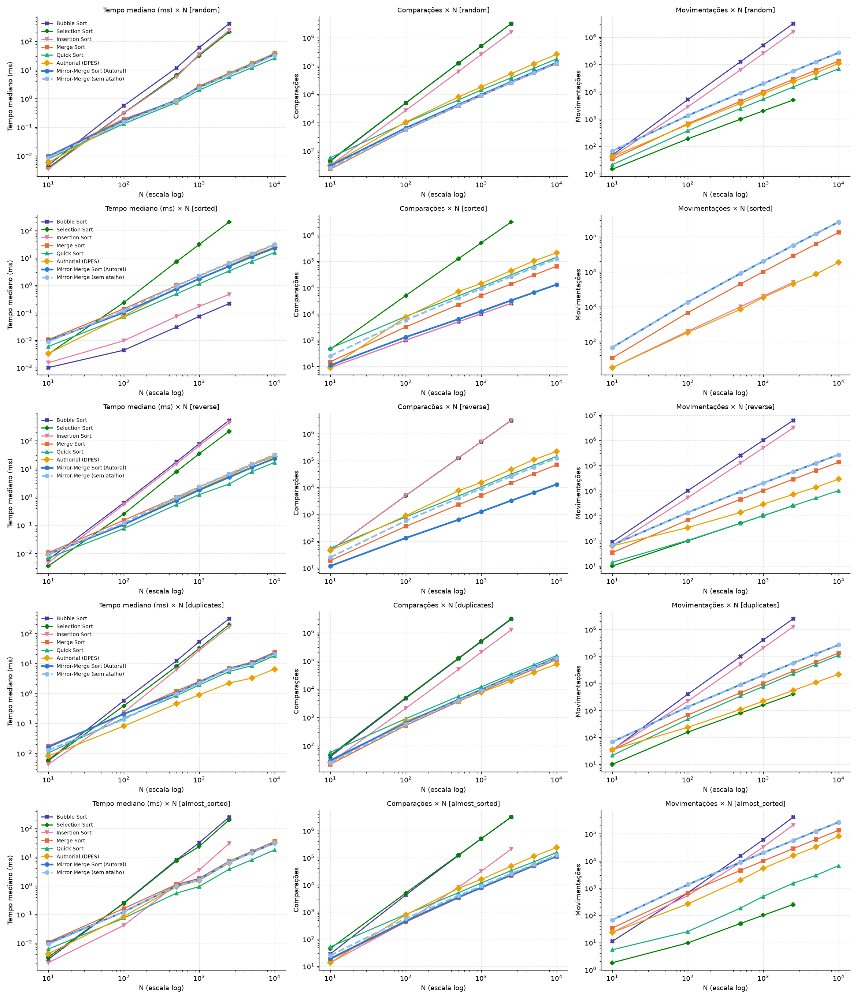

# Relatório Técnico: Mirror-Merge Sort (Ordenação por Fusão Espelhada)

**Trabalho Prático 1 (TP1) de Análise e Projetos de Algoritmos (APA)**
**Autora:** Rafaela Pacheco

> **Natureza do método (declaração de originalidade).** O Mirror-Merge Sort **não é um algoritmo inédito**: é uma **adaptação declarada** que combina duas técnicas publicadas: (i) a fusão bitônica pelas extremidades, descrita por Sedgewick; e (ii) a alternância de direção entre subproblemas, do Bitonic Sort de Batcher. A Seção 1.3 identifica as fontes e a Seção 4.2 descreve as modificações estruturais e compara diretamente com elas.

---

## 1. Concepção e Raciocínio Projetual

### 1.1 O problema do Merge Sort clássico

No Merge Sort tradicional, cada iteração da fusão verifica **duas** condições de fronteira (`i <= mid` **e** `j <= high`), porque qualquer uma das metades pode acabar primeiro. Quando uma delas acaba, são necessários laços adicionais (dois `while` extras) só para esgotar os elementos restantes da outra metade.

### 1.2 A ideia: geometria bitônica

O Mirror-Merge elimina essas verificações mudando a **forma** dos dados antes da fusão. Em vez de ordenar as duas metades no mesmo sentido, ordena a metade esquerda de forma **crescente** e a metade direita de forma **decrescente** (espelhada). O segmento `A[low..high]` passa a ter a forma de uma montanha (uma sequência **bitônica**): sobe até o meio e desce até o fim.

*Metáfora:* numa cordilheira com um único pico, o ponto mais baixo está sempre numa das duas pontas. Se colocarmos um ponteiro em cada extremidade (`i = low`, `j = high`) e sempre retirarmos o menor dos dois, os ponteiros caminham um em direção ao outro. O que resta entre eles continua sendo uma "montanha", mesmo quando um ponteiro atravessa o pico e entra na outra metade. A única condição de parada é `i <= j`: não há teste de fronteira por metade nem laço de esgotamento.

Para que a metade direita já saia **decrescente** da recursão, sem precisar invertê-la depois, cada chamada recebe um parâmetro de direção. Um nó crescente pede ao filho esquerdo uma ordem crescente e ao direito uma decrescente. Um nó decrescente faz o espelho: esquerda decrescente e direita crescente, formando um "vale" cujo **máximo** está sempre numa das pontas.

### 1.3 Origem na literatura (técnicas de base)

| Técnica de origem | Referência | O que foi aproveitado |
| :--- | :--- | :--- |
| Fusão sem sentinelas copiando a 2ª metade **em ordem reversa** (sequência bitônica) e intercalando pelas duas extremidades | R. Sedgewick, *Algorithms in C++, Parts 1–4*, 3ª ed., 1998, Cap. 8 (merge abstrato, Programa 8.2); R. Sedgewick & K. Wayne, *Algorithms*, 4ª ed., 2011, Exercício 2.2.10 ("Faster merge") | O laço de fusão com dois ponteiros vindos das pontas e a condição única `i <= j` |
| Ordenar as duas metades em **sentidos opostos** para formar uma sequência bitônica | K. E. Batcher, "Sorting networks and their applications", *AFIPS Spring Joint Computer Conference*, 1968 (Bitonic Sort) | A recursão com parâmetro de direção que alterna entre os filhos |

---

## 2. Especificação Formal

### 2.1 Pseudocódigo

```text
função MirrorMergeSort(A, low, high, crescente):
    se low >= high:
        retornar

    mid = low + (high - low) / 2          // divisão inteira: |esq| = ⌈n/2⌉, |dir| = ⌊n/2⌋

    // Chamadas espelhadas
    MirrorMergeSort(A, low, mid, crescente)
    MirrorMergeSort(A, mid + 1, high, não crescente)

    // Fusão bitônica
    i = low
    j = high
    k = low

    enquanto i <= j faça:
        se crescente:
            se A[i] <= A[j]:
                Temp[k] = A[i]
                i = i + 1
            senão:
                Temp[k] = A[j]
                j = j - 1
        senão: // decrescente
            se A[i] >= A[j]:
                Temp[k] = A[i]
                i = i + 1
            senão:
                Temp[k] = A[j]
                j = j - 1
        k = k + 1

    copiar Temp[low..high] para A[low..high]
```

Chamada inicial: `MirrorMergeSort(A, 0, n-1, verdadeiro)`, com `Temp` alocado uma única vez com tamanho `n`.

### 2.2 Exemplo passo a passo

Vetor inicial: `[8, 3, 5, 2]` (crescente)

1. **Divisão e chamada recursiva:**
   - Esquerda `[8, 3]` → ordena crescente.
   - Direita `[5, 2]` → ordena decrescente.
2. **Resolução da esquerda `[8, 3]` (crescente):**
   - Esquerda `[8]` (crescente), direita `[3]` (decrescente).
   - Merge crescente: `i=0` (8), `j=1` (3). `8 <= 3`? Falso. Pega o 3, `j--`. Depois `i = j = 0`: pega o 8. Resultado: `[3, 8]`.
3. **Resolução da direita `[5, 2]` (decrescente):**
   - Esquerda `[5]` (decrescente), direita `[2]` (crescente).
   - Merge decrescente: `i=2` (5), `j=3` (2). `5 >= 2`? Verdadeiro. Pega o 5, `i++`. Pega o 2. Resultado: `[5, 2]`.
4. **Merge final (crescente):** `A = [3, 8, 5, 2]`. A metade esquerda sobe (3, 8) e a direita desce (5, 2).

| Passo | `i` (A[i]) | `j` (A[j]) | Comparação | Ação | `Temp` |
| :-: | :-: | :-: | :-: | :-: | :-- |
| 1 | 0 (3) | 3 (2) | 3 ≤ 2? não | pega A[j], `j--` | [2] |
| 2 | 0 (3) | 2 (5) | 3 ≤ 5? sim | pega A[i], `i++` | [2, 3] |
| 3 | 1 (8) | 2 (5) | 8 ≤ 5? não | pega A[j], `j--` | [2, 3, 5] |
| 4 | 1 (8) | 1 (8) | 8 ≤ 8? sim | pega A[i], `i++` | [2, 3, 5, 8] |

`i = 2 > j = 1`: fim da fusão. Vetor ordenado: `[2, 3, 5, 8]`.
Total de comparações: 1 + 1 + 4 = **6**. Isso confere com a fórmula da Seção 3.1: C(4) = 4·2 − 4 + 4 = 6.

### 2.3 Invariantes e prova de corretude

**Definição.** Um segmento `A[i..j]` é uma **montanha** se existe `p` com `i−1 ≤ p ≤ j` tal que `A[i..p]` é não-decrescente e `A[p+1..j]` é não-crescente. É um **vale** se vale o simétrico (desce até `p` e depois sobe).

**Lema 1 (extremos nas pontas).** Se `A[i..j]` (não vazio) é uma montanha, então `min A[i..j] = min(A[i], A[j])`. Se é um vale, `max A[i..j] = max(A[i], A[j])`.
*Prova.* Numa montanha, o menor elemento da parte que sobe é `A[i]` e o menor da parte que desce é `A[j]`. Logo o mínimo global é o menor dos dois. O caso do vale é simétrico. ∎

**Lema 2 (fechamento).** Remover `A[i]` ou `A[j]` de uma montanha (ou vale) produz outra montanha (ou vale), possivelmente vazia.
*Prova.* Retirar o primeiro elemento de uma sequência que sobe e depois desce mantém o formato (se `p = i−1`, o que resta só desce). O mesmo vale para o último elemento. ∎

**Invariante de laço da fusão (caso crescente).** No início de cada iteração do `enquanto i <= j`:

- **(I1)** `k − low = (i − low) + (high − j)`, ou seja, foram escritos exatamente tantos elementos quantos foram consumidos pelas duas pontas;
- **(I2)** `Temp[low..k−1]` está em ordem não-decrescente e, somado ao multiconjunto `A[i..j]`, forma exatamente o multiconjunto original de `A[low..high]`;
- **(I3)** todo elemento de `Temp[low..k−1]` é `≤` todo elemento de `A[i..j]`;
- **(I4)** `A[i..j]` é uma montanha.

*Inicialização.* `i = low`, `j = high`, `k = low`: (I1) vale (0 = 0), (I2) e (I3) valem trivialmente com `Temp` vazio. Pela hipótese de indução (abaixo), `A[low..mid]` está crescente e `A[mid+1..high]` decrescente, então (I4) vale com `p = mid`.

*Manutenção.* Pelo Lema 1 e (I4), o elemento escolhido `x = min(A[i], A[j])` é o mínimo de `A[i..j]`. Por (I3), `x` é maior ou igual a tudo que já está em `Temp`, então anexá-lo mantém (I2) ordenado e (I3) verdadeiro. Avança-se exatamente um de `i`/`j` e também `k`, o que mantém (I1). Pelo Lema 2, (I4) continua valendo.

*Término.* O laço para quando `i = j + 1`. Então `A[i..j]` é vazio e, por (I1), `k = high + 1`. Por (I2), `Temp[low..high]` contém todos os elementos do segmento em ordem não-decrescente. A cópia final leva essa ordem para `A[low..high]`.

O caso decrescente é idêntico, trocando montanha por vale, mínimo por máximo e `≤` por `≥`.

**Corretude da recursão (indução forte em n = high − low + 1).** *Base:* n ≤ 1, o segmento já está ordenado em qualquer direção. *Passo:* por hipótese, as chamadas deixam `A[low..mid]` ordenado no sentido `crescente` e `A[mid+1..high]` no sentido oposto. Isso é exatamente a pré-condição de montanha (ou vale) usada pela fusão, que então ordena o segmento no sentido `crescente`. ∎

**Terminação.** Cada chamada com n ≥ 2 gera subproblemas de tamanhos ⌈n/2⌉ < n e ⌊n/2⌋ < n. Cada iteração da fusão reduz `j − i` em 1.

---

## 3. Análise Assintótica Teórica

### 3.1 Comparações: fórmula exata, independente da entrada

Numa fusão de um segmento de tamanho `m`, o laço `enquanto i <= j` executa **exatamente `m` iterações**: por (I1), cada iteração consome um elemento, e o laço só para quando todos os `m` foram consumidos. Cada iteração faz **exatamente uma** comparação entre chaves. Como nenhum teste depende dos valores para decidir *quantas* iterações ocorrem, o número de comparações é o mesmo para qualquer entrada de tamanho `n`:

$$C(1) = 0, \qquad C(n) = C(\lceil n/2 \rceil) + C(\lfloor n/2 \rfloor) + n \quad (n \ge 2).$$

**Solução para potências de 2** ($n = 2^h$). Desdobrando: $C(n) = 2C(n/2) + n = 4C(n/4) + 2n = \dots = 2^h C(1) + h\,n = n \log_2 n$.

**Solução geral** (qualquer $n$). Seja $L = \lceil \log_2 n \rceil$. Então

$$C(n) = n\lceil \log_2 n\rceil - 2^{\lceil \log_2 n\rceil} + n.$$

*Justificativa.* A recorrência do pior caso do Merge Sort clássico, $W(n) = W(\lceil n/2\rceil) + W(\lfloor n/2\rfloor) + (n-1)$, tem a solução conhecida $W(n) = nL - 2^L + 1$ (Knuth, *TAOCP* vol. 3, §5.2.4). Temos $C(n) - W(n) = $ (número de fusões) $\cdot 1 = n - 1$, porque a árvore de recursão tem $n$ folhas e, sendo binária, $n-1$ nós internos, cada um contribuindo com 1 comparação a mais. Logo $C(n) = nL - 2^L + 1 + (n-1)$. ∎

*Verificação empírica:* a fórmula foi conferida para **todo** $n$ de 1 a 2999 com entradas aleatórias, ordenadas e reversas, e está automatizada em `test_suite.py` (`TestMirrorMergeScaling`). Exemplos: $C(8)=24$, $C(64)=384$, $C(1024)=10240$.

Como $n\lceil\log_2 n\rceil - 2^L + n$ está entre $n\log_2 n$ e $n\log_2 n + n$, temos:

| Caso | Resultado | Justificativa |
| :--- | :--- | :--- |
| **Melhor caso** | $\Omega(n \log n)$ | $C(n) \ge n\log_2 n$ para qualquer entrada |
| **Pior caso** | $O(n \log n)$ | $C(n) \le n\log_2 n + n$ para qualquer entrada |
| **Caso médio** | $\Theta(n \log n)$ | Melhor = pior = médio: o custo **não depende** da disposição dos dados |

A árvore de recursão tem altura $\lceil \log_2 n\rceil$. Em cada nível, as fusões somam no máximo $n$ iterações, cada uma com trabalho $O(1)$ (uma comparação, uma escrita, atualização de índices). O tempo total é, portanto, $\Theta(n\log n)$ em todos os casos.

> **Observação crítica.** O caso `i = j` (último elemento de cada fusão) compara `A[i]` consigo mesmo. É por isso que o custo por fusão é `m` e não `m − 1`. Consequência: o Mirror-Merge faz **sempre pelo menos tantas comparações de chave quanto o Merge Sort clássico**. O clássico faz entre `⌊m/2⌋` e `m − 1` por fusão e chega a ≈ ½·n·log₂n em vetores já ordenados. O ganho do Mirror-Merge **não é em comparações de chave**. Ele está em trocar dois testes de fronteira por iteração (`i ≤ mid`, `j ≤ high`) por um só (`i ≤ j`) e em eliminar os laços de esgotamento.

### 3.2 Movimentações

Cada fusão de tamanho `m` faz `m` escritas em `Temp` e `m` cópias de volta para `A`. Portanto:

$$M(n) = 2\,C(n) = 2\left(n\lceil\log_2 n\rceil - 2^{\lceil\log_2 n\rceil} + n\right) = \Theta(n\log n),$$

também independente da entrada, e também verificado em `test_suite.py`.

### 3.3 Espaço auxiliar

- **Vetor `Temp`:** alocado uma única vez, com tamanho `n` → $O(n)$.
- **Pilha de recursão:** profundidade $\lceil\log_2 n\rceil$ → $O(\log n)$.
- **Total:** $O(n)$. **Não é in-place**: precisa de um buffer do mesmo tamanho da entrada, como o Merge Sort clássico.

### 3.4 Estabilidade: **não é estável**

**Contraexemplo mínimo.** Entrada com chaves `[1, 2, 1, 1]`, rotuladas pela posição original como `1ₐ, 2_b, 1_c, 1_d`:

1. Esquerda `[1ₐ, 2_b]` ordenada crescente → `[1ₐ, 2_b]`.
2. Direita `[1_c, 1_d]` ordenada **decrescente**. No empate, `>=` escolhe `A[i]` → `[1_c, 1_d]`.
3. Fusão final crescente sobre `[1ₐ, 2_b, 1_c, 1_d]`, com `j` lendo a metade direita **de trás para frente**:
   - `1ₐ ≤ 1_d` → pega `1ₐ`;
   - `2_b ≤ 1_d`? não → pega `1_d`;
   - `2_b ≤ 1_c`? não → pega `1_c`;
   - pega `2_b`.
4. Saída: `1ₐ, 1_d, 1_c, 2_b`. O `1_d` passou à frente do `1_c`, invertendo a ordem relativa original.

(Esse contraexemplo é um teste automatizado: `test_not_stable_counterexample`.) Em 200 vetores aleatórios de tamanho 2 a 40 com chaves em {0..3}, a ordem relativa dos iguais foi violada em 175.

**Por que a instabilidade é estrutural (e não um detalhe do `>=`).** Há duas causas independentes:

1. **Leitura reversa da metade espelhada.** A metade decrescente é consumida por `j` do fim para o começo. Então, se ela guardar os iguais em ordem original, eles saem invertidos. Isso sugere trocar `>=` por `>` na fusão decrescente, para que a metade espelhada guarde os iguais já invertidos.
2. **Travessia do pico.** Mesmo com essa troca, quando uma metade se esgota, o ponteiro que sobrou **atravessa o pico** e passa a ler a outra metade **pelo lado oposto** ao que a regra de desempate supõe. Com `>` no lugar de `>=`, a entrada `[0, 0, 0, 0]` já sai como `0₀, 0₁, 0₃, 0₂` (testado).

Ou seja, a mesma propriedade que elimina os testes de fronteira (poder atravessar o pico sem checar) é o que impede a estabilidade. Sedgewick registra a mesma limitação para a sua versão (Exercício 2.2.10: *"the resulting sort is not stable"*).

### 3.5 Resumo das propriedades

| Propriedade | Mirror-Merge Sort |
| :--- | :--- |
| Melhor caso | $\Omega(n\log n)$, exatamente $C(n)$ comparações |
| Pior caso | $O(n\log n)$, exatamente $C(n)$ comparações |
| Caso médio | $\Theta(n\log n)$ |
| Espaço auxiliar | $O(n)$ (+ $O(\log n)$ de pilha) |
| Estável | **Não** (Seção 3.4) |
| In-place | **Não** (buffer `Temp` de tamanho n) |
| Adaptativo | **Não**: o custo é idêntico para entradas ordenadas, reversas ou aleatórias |

---

## 4. Comparação com a Literatura

### 4.1 Tabela comparativa

| Característica | Mirror-Merge Sort | Merge Sort | Quick Sort (mediana de 3) | Insertion Sort | Selection Sort |
| :--- | :--- | :--- | :--- | :--- | :--- |
| **Melhor caso** | $\Theta(n \log n)$ | $\Theta(n \log n)$ | $\Theta(n \log n)$ | $\Theta(n)$ | $\Theta(n^2)$ |
| **Pior caso** | $\Theta(n \log n)$ | $\Theta(n \log n)$ | $\Theta(n^2)$ | $\Theta(n^2)$ | $\Theta(n^2)$ |
| **Caso médio** | $\Theta(n \log n)$ | $\Theta(n \log n)$ | $\Theta(n \log n)$ | $\Theta(n^2)$ | $\Theta(n^2)$ |
| **Comparações por fusão/passo** | exatamente `m` | entre `⌊m/2⌋` e `m−1` | N/A | N/A | N/A |
| **Espaço auxiliar** | $O(n)$ | $O(n)$ | $O(\log n)$ | $O(1)$ | $O(1)$ |
| **Estável?** | Não | Sim | Não | Sim | Não |
| **In-place?** | Não | Não | Sim | Sim | Sim |
| **Testes de fronteira na fusão** | 1 por iteração (`i ≤ j`), sem laços de esgotamento | 2 por iteração + 2 laços de esgotamento | N/A | N/A | N/A |

### 4.2 Diferenças em relação às técnicas de origem

**Frente ao Merge Sort clássico (Von Neumann).**
- *Teórica:* mesma ordem de crescimento $\Theta(n\log n)$ e mesmo espaço $O(n)$. O Mirror-Merge, porém, **perde a estabilidade** e faz **mais comparações de chave** (exatamente `m` por fusão contra no máximo `m − 1`). Em compensação, sua contagem é **determinística**: não depende da entrada.
- *Prática:* o laço interno tem um único teste de fronteira e não há laços de esgotamento. Em contrapartida, a implementação atual testa `se crescente` **dentro** do laço, um desvio extra por iteração cujo valor nunca muda durante a fusão (ver Seção 6).

**Frente à fusão bitônica de Sedgewick (modificação estrutural introduzida).**
- *Sedgewick:* ordena as duas metades no **mesmo** sentido e, na fusão, **copia a segunda metade invertida** para o vetor auxiliar para criar a montanha. Só existe um sentido de ordenação.
- *Mirror-Merge:* **não há passo de inversão**. A montanha é produzida pela própria recursão, que alterna o sentido entre filho esquerdo e direito (ideia de Batcher). Para isso, a rotina precisa saber **ordenar e fundir nos dois sentidos** (montanha → crescente, vale → decrescente). Essa é a modificação estrutural central.
- *Custo:* o número de movimentações é o mesmo (2m por fusão nos dois casos: m para o auxiliar e m de volta). A diferença é que a inversão deixa de ser um passo explícito e vira uma propriedade da recursão.

**Frente ao Bitonic Sort de Batcher.**
- Batcher também ordena as metades em sentidos opostos, mas funde a sequência bitônica com uma **rede de comparadores** (meia-limpeza recursiva) de custo $\Theta(n\log n)$ por fusão, totalizando $\Theta(n\log^2 n)$ comparações. Em troca, ele é paralelizável e independente dos dados.
- O Mirror-Merge funde a mesma sequência bitônica **sequencialmente** com dois ponteiros em $\Theta(n)$, totalizando $\Theta(n\log n)$. Mantém a propriedade de Batcher de ter uma sequência de operações sem dependência dos valores (sempre `C(n)` comparações), mas perde o paralelismo.

**Frente ao Quick Sort.** Ambos são $\Theta(n\log n)$ no caso médio. O Quick Sort é in-place ($O(\log n)$ de pilha) mas tem pior caso $\Theta(n^2)$. A mediana de três só atenua esse risco. O Mirror-Merge garante $\Theta(n\log n)$ em qualquer entrada, ao custo de $O(n)$ de memória extra.

**Frente ao Insertion Sort.** O Insertion Sort é **adaptativo**: $\Theta(n)$ em vetores já ordenados, o que o faz vencer em entradas pequenas ou quase ordenadas. O Mirror-Merge não aproveita nenhuma ordem pré-existente. Em contrapartida, não degrada para $\Theta(n^2)$ nas entradas aleatórias e reversas.

---

## 5. Resultados Experimentais

### 5.1 Metodologia

- **Ambiente:** Python 3.13.9, Windows 11, execução em um único processo. Reproduzível com `make benchmark_python` ou `python python/benchmark.py --trials 5`.
- **Tamanhos:** N ∈ {10, 100, 500, 1000, 2500, 5000, 10000}. Os algoritmos $\Theta(n^2)$ (Bubble, Selection, Insertion) param em N = 2500, porque em Python levam minutos por medição a partir daí.
- **Cenários:** aleatório uniforme, já ordenado, estritamente reverso, com muitas repetições (5 valores distintos) e quase ordenado (~5% de trocas).
- **Repetições:** 5 vetores independentes por (cenário, N), usados igualmente por todos os algoritmos. O tempo reportado é média ± desvio-padrão. Toda saída é conferida contra `sorted()`.
- **Artefatos:** `python/benchmark_results.png` (tempo, comparações e movimentações × N, em escala log-log), `python/benchmark_results.csv` (todos os números) e `python/benchmark_output.md` (tabelas de tempo).



### 5.2 Comparações: a fórmula exata confirmada

| Cenário | N | Mirror-Merge | Merge Sort | Quick Sort | Insertion Sort |
| :--- | ---: | ---: | ---: | ---: | ---: |
| Aleatório | 1 000 | 9 976 | 8 702 | 13 811 | 252 314 |
| Aleatório | 10 000 | 133 616 | 120 481 | 177 355 | não medido |
| Ordenado | 10 000 | 133 616 | 64 608 | 143 151 | (999 em N = 10³) |
| Reverso | 10 000 | 133 616 | 69 008 | 143 167 | não medido |
| Repetidos | 10 000 | 133 616 | 111 566 | 153 112 | não medido |

- O Mirror-Merge produz **exatamente** o mesmo número em todos os cenários, e ele coincide com $C(n)$: $C(1000) = 1000\cdot10 - 1024 + 1000 = 9976$ e $C(10000) = 10000\cdot14 - 16384 + 10000 = 133616$. Isso confirma empiricamente a Seção 3.1, inclusive que melhor, pior e caso médio são iguais.
- No caso aleatório, o Mirror-Merge faz ≈ 11% mais comparações que o Merge clássico. Em vetores ordenados ou reversos, faz ≈ 2× mais, porque o clássico esgota uma metade depois de ≈ m/2 comparações e copia o resto sem comparar. Isso confirma a observação crítica da Seção 3.1.
- Em todos os cenários, faz menos comparações que o Quick Sort e ordens de grandeza menos que o Insertion Sort (exceto no vetor já ordenado, em que o Insertion faz n − 1).

### 5.3 Movimentações

| Cenário | N | Mirror-Merge | Merge Sort | Quick Sort | Insertion Sort |
| :--- | ---: | ---: | ---: | ---: | ---: |
| Aleatório | 10 000 | 267 232 | 133 616 | 68 992 | não medido |
| Ordenado | 10 000 | 267 232 | 133 616 | 0 | (1 998 em N = 10³) |
| Reverso | 10 000 | 267 232 | 133 616 | 10 004 | não medido |

- O Mirror-Merge tem exatamente $M(n) = 2C(n)$ movimentações, independente da entrada (Seção 3.2).
- **Atenção à comparação com o Merge Sort do pacote:** a implementação de `classical.py` conta só os `append` na lista resultante (1 por elemento por nível). As cópias feitas pelo fatiamento `lst[:mid]` não entram na contagem. O Mirror-Merge conta as duas escritas (em `Temp` e de volta em `A`). Com o mesmo critério, os dois fariam o mesmo número de movimentações. O fator 2 no gráfico é **artefato de instrumentação**, não diferença algorítmica.
- O Quick Sort com partição de Hoare move muito menos, e zero em vetor já ordenado, porque só troca elementos fora do lugar.

### 5.4 Tempo de execução (ms, média ± desvio, 5 repetições)

| Cenário | N | Mirror-Merge | Merge Sort | Quick Sort | Insertion Sort |
| :--- | ---: | ---: | ---: | ---: | ---: |
| Aleatório | 1 000 | 3.52 ± 0.20 | 3.99 ± 0.81 | 2.50 ± 0.27 | 44.64 ± 2.01 |
| Aleatório | 10 000 | 47.06 ± 1.35 | 47.29 ± 2.46 | 31.36 ± 0.68 | não medido |
| Ordenado | 10 000 | 52.50 ± 10.14 | 38.01 ± 0.95 | 19.44 ± 0.80 | (0.21 em N = 10³) |
| Reverso | 10 000 | 45.92 ± 2.77 | 37.43 ± 1.32 | 20.38 ± 0.83 | não medido |
| Repetidos | 10 000 | 42.00 ± 0.53 | 41.50 ± 1.61 | 28.52 ± 0.33 | 31.18 (N = 10³) |

**Análise crítica.**
1. **A curva de crescimento confirma $\Theta(n\log n)$.** No gráfico log-log, o Mirror-Merge acompanha paralelamente o Merge e o Quick Sort. Os algoritmos $\Theta(n^2)$ têm inclinação visivelmente maior (≈ 2). De N = 10³ para 10⁴ (10×), o tempo do Mirror-Merge cresceu ≈ 13×, compatível com $10 \cdot \log(10^4)/\log(10^3) \approx 13{,}3$.
2. **No caso aleatório, empata com o Merge clássico** (diferença menor que o desvio-padrão). Nos cenários ordenado e reverso, é **mais lento**, porque o clássico faz metade das comparações (Seção 5.2). A redução de testes de fronteira **não aparece como ganho mensurável em Python**, onde cada iteração custa dezenas de instruções de bytecode e o desvio extra é irrelevante (ver Seção 6, itens 3 e 5).
3. **O Quick Sort é o mais rápido** em todos os cenários: é in-place, move pouco e, com mediana de três, não degrada em entradas ordenadas ou reversas.
4. **Estabilidade de desempenho:** o tempo do Mirror-Merge praticamente não varia entre os cenários (42–52 ms em N = 10⁴). Isso é coerente com o custo independente da entrada. A variação que resta vem de ruído de medição (desvio de 10 ms no cenário ordenado) e de efeitos de cache e do interpretador.
5. **Validade:** a implementação clássica do Merge Sort usa fatiamento e `append` (listas novas a cada chamada), enquanto o Mirror-Merge usa índices sobre um buffer único. As diferenças de tempo misturam, portanto, efeito algorítmico e estilo de implementação. As **contagens** (5.2 e 5.3) são a evidência mais confiável.

---

## 6. Limitações e Pensamento Crítico

1. **Não estável, por construção** (Seção 3.4). A travessia do pico, que é o que elimina os testes de fronteira, é também o que impede a estabilidade.
2. **Mais comparações de chave que o Merge Sort clássico.** A vantagem está no fluxo de controle (menos testes de índice), não em comparações de chave. Se comparar chaves é caro (strings longas, objetos com `__le__` custoso), o clássico tende a ganhar.
3. **Desvio de direção dentro do laço.** O `se crescente` é avaliado a cada iteração embora seja constante durante toda a fusão. Duplicar o laço (um para cada sentido) removeria esse teste e aproximaria a implementação da vantagem teórica de "um único teste por iteração".
4. **Não adaptativo.** O custo é idêntico para entradas ordenadas e aleatórias. Um teste prévio `A[mid] ≤ A[mid+1]` (comum em implementações industriais do Merge Sort) não se aplica diretamente, porque as metades estão em sentidos opostos.
5. **Tempo medido em Python.** Em Python, o custo dominante é o interpretador, não o desvio de hardware. A vantagem de "menos desvios" só poderia ser medida de forma convincente numa linguagem compilada (C++), o que fica como trabalho futuro.

---

## 7. Declaração Obrigatória de Autoria e Uso de IA

### 7.1 Gemini

- **Ferramenta/fonte utilizada:** IA Generativa Gemini 3.1 Pro (via Antigravity AI).
- **Motivo de uso:** brainstorming para chegar a um método que fosse além de uma variação cosmética; revisão das demonstrações de corretude; implementação inicial e execução automatizada da suíte de testes.
- **Como foi utilizada:**
  1. Diálogo sobre famílias de ordenação, que levou à ideia da sequência bitônica para eliminar os testes de fronteira.
  2. Escrita do código guiada pelo template `student_template.py`.
  3. Execução das ferramentas de benchmark.
- **Modificações realizadas:** *(a preencher pela autora: descrever com as próprias palavras o que foi decidido/alterado manualmente, por exemplo, a escolha de alternar a direção na recursão, a escolha de `<=`/`>=` nos desempates, ajustes no código gerado.)*
- **Como o resultado foi validado:** teste de mesa em vetores pequenos (Seção 2.2) e aprovação na suíte `test_suite.py`.

### 7.2 Claude

- **Ferramenta/fonte utilizada:** Claude Opus 5.5 (Anthropic), via Claude Code.
- **Motivo de uso:** revisar a conformidade do projeto com o enunciado do TP1 antes da entrega.
- **Como foi utilizada:**
  1. **Auditoria**: comparou o projeto com o checklist do enunciado e apontou (a) a afirmação incorreta de estabilidade, com contraexemplo, (b) a ausência de atribuição às técnicas de Sedgewick e Batcher, e (c) a afirmação incorreta de que o método faz menos comparações.
  2. **Testes**: adicionou o Mirror-Merge à suíte `test_suite.py` (classes `TestMirrorMergeSort` e `TestMirrorMergeScaling`, com N = 10 a 10⁴ nos cenários obrigatórios, verificação da fórmula exata de comparações e movimentações e o contraexemplo de instabilidade).
  3. **Benchmark**: estendeu `benchmark.py` até N = 10⁴, com 5 repetições, desvio-padrão, gráfico de movimentações × N, eixos log-log e exportação CSV.
  4. **Relatório**: redigiu as Seções 2.3 (invariantes), 3 (dedução da recorrência e fórmula fechada, estabilidade), 4.2 (comparação com as técnicas de origem), 5 e 6, a partir das medições.
  - O algoritmo (`my_authorial_sort` em `student_template.py`) **não foi alterado** pelo Claude.
- **Modificações realizadas:** *(a preencher pela autora: o que foi reescrito, cortado ou corrigido no texto sugerido.)*
- **Como o resultado foi validado:** a fórmula $C(n)$ foi checada por execução para todo n de 1 a 2999 e está automatizada nos testes; o contraexemplo de instabilidade é um teste automatizado; a suíte completa (78 testes) passa. *(a autora deve acrescentar sua própria verificação, por exemplo refazer a dedução da Seção 3.1 à mão.)*
